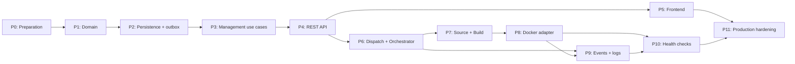

# Deployment Implementation Plan

| Field | Value |
| --- | --- |
| Status | Ready for engineering execution |
| Architecture authority | [RFC-0001: Deployment Management Architecture](../rfcs/RFC-0001-Deployment-Engine.md) |
| Intended audience | DocAI Cloud backend and frontend engineers |
| Scope | Deployment Engine MVP and the operational foundations required to run it safely |
| Out of scope | Production code, provider choice beyond the initial Docker adapter, and post-MVP platform features |

## 1. Overview

This document is the execution plan for the Deployment Engine. RFC-0001 defines the architecture, terminology, invariants, and ownership boundaries. It is the source of truth for *what* the system is. This plan defines *how and in what order* the engineering team will deliver it.

The plan deliberately begins with the domain and persistence contracts, then adds use cases, API/read surfaces, orchestration, and finally real infrastructure. This sequencing means Docker is the last replaceable adapter added to an already-tested deployment workflow, not the place where the workflow is invented.

The current repository contains a synchronous `DeployService` that mutates `Project.status`, clones source directly, and performs work in the API request path. It is a prototype, not a migration target. The implementation must replace it with Deployment-owned state without changing the meaning of historical Project data or exposing a broken transition period to users.

### MVP delivery boundary

The MVP is complete when an authorized user can create an immutable Deployment for a Project, observe its ordered history and current status, stop it, and see a Docker-backed workload reach `Healthy` or a classified terminal failure. The lifecycle is driven asynchronously, is safe under duplicate delivery, and can recover unfinished work after a process restart.

It does not include custom domains, multi-region placement, horizontal scaling, rollback traffic cutover, multi-provider scheduling, or a full build service. These are explicitly deferred in Section 10.

## 2. Engineering Principles

1. **Implement the domain before infrastructure.** No Docker, subprocess, Git, HTTP, queue, or database type may appear in Deployment domain policy.
2. **Preserve RFC-0001 contracts.** The finite state machine, immutable deployment facts, append-only events, and layer boundaries are not implementation suggestions.
3. **Every phase leaves main buildable and testable.** Feature flags or internal-only routes are preferable to a partially wired production path.
4. **Use vertical slices after the domain exists.** Each slice must include contract tests at its boundary rather than accumulating an untested “platform layer.”
5. **Never update `Project.status` to represent a deployment lifecycle.** A Project remains long-lived; `Deployment.status` is the lifecycle projection.
6. **Treat all asynchronous delivery as at-least-once.** Commands, stage operations, event publication, and cleanup must be idempotent.
7. **Make historical records durable before side effects.** Persist a deployment and its initial event before dispatching work; use an outbox-equivalent handoff.
8. **Prefer small pull requests.** One concern, one reviewable change, clear rollback, and focused tests. Large “deployment engine” pull requests are prohibited.
9. **Preserve compatibility deliberately.** Existing project endpoints and UI may be adapted, but no consumer should be silently reinterpreted from Project status to Deployment status.
10. **Use production-shaped seams early.** SQLite is acceptable for MVP persistence only if migration, ordering, concurrency, and reliable-dispatch semantics are tested as contracts that PostgreSQL can preserve.
11. **Never log secrets or make provider metadata public API.** Public representations use stable Deployment data; diagnostics use controlled correlations.
12. **Measure before automating recovery.** State transition metrics and structured events come before aggressive retries or automated cleanup policies.

### Change-control rules

- Any proposed new Deployment Status, transition, or event type requires an RFC-0001 compatibility review.
- Any provider-specific field proposed for a domain record requires an explicit exception and an adapter-owned alternative.
- Schema migrations are forward-only, reviewed, rehearsed against a representative database copy, and paired with rollback/restore instructions.
- A phase may start only after its listed dependencies meet their Definition of Done; a local manual demo is not a substitute.

## 3. Phase Breakdown

Durations are planning ranges for a small team with one primary implementer per critical-path phase. They include focused testing and review, not remediation of newly discovered critical issues. They are not additive because the permitted parallel work is shown in Section 5.

### Phase 0 — Project Preparation and Safety Rails

**Purpose.** Establish a safe delivery baseline and document the replacement boundary around the existing synchronous deploy path. This prevents schema, test, and ownership work from being invented while production behavior is already changing.

**Estimated complexity and duration.** Medium; 3–5 engineering days. Estimate assumes one backend engineer with frontend/CI support available for review.

**Deliverables.** A repository conventions note; backend test harness and fixtures; frontend test/lint baseline; a CI gate for tests, formatting, static analysis, and migration checks; a short migration note for the legacy `Project.status` field; and a tracked feature flag/configuration gate for the new deployment API.

**Files to create.** `backend/tests/`; `backend/tests/conftest.py` (test fixture location); `backend/tests/architecture/`; `docs/implementation/deployment-migration-notes.md`; `.github/workflows/ci.yml` or the repository's existing CI-equivalent configuration.

**Files to modify.** `backend/requirements.txt`; `frontend/package.json`; repository-level developer documentation; `backend/app/config.py`; `backend/app/main.py` only to register safe startup configuration, not deployment behavior.

**Dependencies.** None.

**Acceptance criteria.** A clean checkout runs backend and frontend checks in CI; tests do not use the developer's `users.db`; the existing deployment endpoint is characterized by tests; and the team has agreed whether legacy Project status remains read-only during migration or is hidden behind a compatibility representation.

**Testing strategy.** Add characterization tests for current project import/read/delete and deploy behavior. Run checks in a fresh process to reveal reliance on local state. Confirm test fixtures reset both database and deployment temp directories.

**Risks.** Test setup may expose unrelated repository issues; do not solve unrelated product defects in this phase. Feature flags can become permanent if no removal owner is assigned.

**Future improvements.** Ephemeral PostgreSQL integration environments and contract-test containers belong after the MVP test seam is stable.

### Phase 1 — Deployment Domain

**Purpose.** Implement the provider-neutral language and state-machine policy from RFC-0001 as a pure, deterministic domain module. This is the smallest high-value slice: it proves the model before persistence, APIs, or Docker exist.

**Estimated complexity and duration.** Medium; 4–6 engineering days. Completion is test-driven and should not be compressed by adding persistence work.

**Deliverables.** Deployment aggregate/entity, immutable deployment specification snapshot, Deployment Status value/enum, typed domain commands and errors, transition policy, Deployment Event definitions, failure categories, and lineage metadata. The module must have no framework or persistence imports.

**Files to create.** `backend/app/deployment_management/domain/`; `deployment.py`; `status.py`; `events.py`; `specification.py`; `failures.py`; `commands.py`; `backend/tests/deployment_management/domain/`.

**Files to modify.** `backend/app/constants/project_status.py` only to mark it legacy/deprecated for deployment use; package initialization files as needed. Do not modify `Project` or `DeployService` behavior yet.

**Dependencies.** Phase 0.

**Acceptance criteria.** Tests prove every valid and invalid transition in RFC-0001; terminal states never revive; stop takes precedence over late success; immutable facts cannot be changed; events are ordered; and a Deployment can be created, failed, stopped, and redeployed as a new lineage-linked Deployment without a provider.

**Testing strategy.** Table-driven unit tests for the full transition matrix, property-style tests for disallowed transitions, and explicit tests for duplicate command/result handling. Test event payload validation rejects secrets and unbounded log text.

**Risks.** Over-designing a general workflow engine or placing repository interfaces inside the aggregate. Keep the API narrow: commands in, decisions/events out.

**Future improvements.** A formal state-machine visualization generated from domain metadata may be added only after the hand-written policy is stable.

### Phase 2 — Persistence, Migrations, and Reliable Dispatch

**Purpose.** Persist Deployment state and append-only history with the atomicity needed before any external side effect occurs. This phase establishes the data contract that all subsequent work depends on.

**Estimated complexity and duration.** High; 7–10 engineering days. Migration rehearsal and failure testing are included in this estimate.

**Deliverables.** A migration tool and forward-only baseline; Deployment and Deployment Event persistence mappings; repository port and SQLAlchemy adapter; optimistic version handling; per-deployment event sequence uniqueness; transaction boundary; durable work-dispatch/outbox record; and a migration path for legacy Project status.

**Files to create.** `backend/migrations/` and migration configuration; `backend/app/deployment_management/application/ports/deployment_repository.py`; `work_dispatch.py`; `backend/app/deployment_management/infrastructure/persistence/`; `deployment_repository.py`; `outbox_repository.py`; `backend/tests/deployment_management/persistence/`.

**Files to modify.** `backend/app/database.py`; `backend/app/main.py` to remove runtime schema creation once migrations are adopted; `backend/app/models/project.py` for a non-destructive relationship/reference only when required; `backend/requirements.txt`; deployment-management package wiring.

**Dependencies.** Phase 1. Phase 0 CI must support a fresh database per test run.

**Acceptance criteria.** A migration can initialize a new database and upgrade a copy containing existing Project records without losing data. A Deployment persists immutable input and current status. Each state change and required outcome event commits atomically. Concurrent expected-version updates allow only one winner. An accepted deployment creates a durable dispatch record in the same transaction.

**Testing strategy.** Migration upgrade tests from the existing schema; repository integration tests against SQLite; transaction rollback tests; uniqueness/ordering tests; concurrent-writer simulation; and outbox recovery tests that simulate a process crash after commit but before dispatch.

**Risks.** SQLite's writer constraints can conceal production concurrency behavior. The test suite must assert behavior, not SQLite-specific lock timing. Avoid database triggers as lifecycle authority; the domain remains the authority.

**Future improvements.** Add PostgreSQL CI coverage before multi-worker production deployment. Do not block the MVP on a database cutover.

### Phase 3 — Deployment Management Use Cases

**Purpose.** Assemble domain and persistence into application services that authorize and record deployment intent without performing source, build, execution, or health work.

**Estimated complexity and duration.** Medium; 5–7 engineering days. Authorization and idempotency are required deliverables, not follow-up work.

**Deliverables.** Command handlers for request deployment, stop deployment, redeploy, inspect deployment, list Project deployments, and read ordered events; Project authorization adapter; release-input resolution contract; command idempotency record/strategy; safe response DTOs; and feature-flagged service wiring.

**Files to create.** `backend/app/deployment_management/application/`; `request_deployment.py`; `stop_deployment.py`; `redeploy.py`; `queries.py`; `authorization.py`; `idempotency.py`; `dto.py`; `backend/tests/deployment_management/application/`.

**Files to modify.** `backend/app/repositories/project_repository.py` to expose only Project ownership/configuration lookup needed by application services; `backend/app/services/deploy_service.py` to deprecate rather than extend it; `backend/app/config.py`.

**Dependencies.** Phases 1–2; existing authentication and Project ownership lookup must be characterized in Phase 0.

**Acceptance criteria.** Requesting a deployment creates `Queued` plus `DeploymentRequested`; repeated requests with the same idempotency key return the same result; stop is accepted only for valid statuses and is idempotent; redeploy creates a new Deployment with immutable lineage; unauthorized users cannot observe or mutate a Deployment; no provider call occurs in any command handler.

**Testing strategy.** Application tests use in-memory/fake repository and outbox ports for decision tests, plus selected real persistence integration tests. Test authorization, stale-version requests, Project archival/deletion policy, and input-resolution failure paths.

**Risks.** Source revision resolution can accidentally become a synchronous clone/build. Keep it as a bounded metadata/pinning contract; actual retrieval happens later. Avoid leaking ORM entities as DTOs.

**Future improvements.** Environment promotion, approvals, and system-initiated deploy triggers can become additional command handlers without changing the aggregate.

### Phase 4 — REST API and Compatibility Migration

**Purpose.** Expose Deployment Management use cases as stable, asynchronous API resources while retiring the legacy synchronous deploy endpoint safely.

**Estimated complexity and duration.** Medium; 4–6 engineering days. Time includes review of public schema and the legacy-route migration decision.

**Deliverables.** Versioned or clearly scoped deployment routes; request/response schemas; idempotency-key handling; pagination/cursors for history; safe error mapping; authorization integration; OpenAPI documentation; API contract tests; and a migration/deprecation response for `POST /projects/{id}/deploy`.

**Files to create.** `backend/app/routes/deployments.py`; `backend/app/schemas/deployment.py`; `backend/tests/api/test_deployments.py`; `docs/implementation/deployment-api-migration.md`.

**Files to modify.** `backend/app/main.py`; `backend/app/routes/deploy.py`; `backend/app/schemas/project.py`; `backend/app/services/deploy_service.py`; frontend API-client configuration only if a version prefix is introduced.

**Dependencies.** Phase 3.

**Acceptance criteria.** The API supports create/list/get/events/stop/redeploy as defined by RFC-0001. Create returns an accepted `Queued` resource rather than waiting for work. Mutating calls require idempotency keys. Existing project-read endpoints remain compatible. The legacy deploy route either delegates to the new request command with documented response compatibility or returns a documented deprecation response behind a release flag; it must never invoke direct cloning.

**Testing strategy.** API tests cover authentication, cross-tenant access, validation, duplicate keys, pagination stability, event ordering, transition errors, and safe failure payloads. Add consumer-style tests for existing project UI reads.

**Risks.** Exposing raw event or provider payloads creates an irreversible API contract. Map only stable domain data. Do not expose legacy `Project.status` as the current deployment state.

**Future improvements.** Server-sent events/websocket delivery may be added from the durable event feed after polling semantics are reliable.

### Phase 5 — Frontend Deployment Experience

**Purpose.** Move the user experience from mutable Project status to explicit deployment history and current Deployment Status. This delivers value before real execution is enabled and validates the API model with a consumer.

**Estimated complexity and duration.** Medium; 5–8 engineering days. It can overlap with Phase 6 once Phase 4 contracts are stable.

**Deliverables.** Deployment list and detail/timeline views on Project details; deploy, stop, and redeploy actions; status and terminal-failure presentation; polling with bounded backoff; clear “accepted/queued” feedback; and user-facing error handling that does not reveal infrastructure details.

**Files to create.** `frontend/src/types/deployment.ts`; `frontend/src/services/deployments.ts`; `frontend/src/hooks/useDeployments.ts`; `useDeployment.ts`; `frontend/src/components/DeploymentTimeline.tsx`; `DeploymentStatusBadge.tsx`; `frontend/src/components/DeploymentActions.tsx`; frontend tests colocated with these modules or in the configured test location.

**Files to modify.** `frontend/src/pages/ProjectDetailsPage.tsx`; `frontend/src/services/projects.ts`; `frontend/src/types/project.ts`; `frontend/src/components/StatusBadge.tsx` if retained for Project-only display; application routes/styles as required.

**Dependencies.** Phase 4. It may begin against API mocks once schema is agreed, but merging depends on contract tests.

**Acceptance criteria.** A Project page displays deployments independently from Project metadata; users can trigger a deployment and see `Queued` without blocking; events appear in sequence; terminal failure shows safe category/message; active statuses refresh without duplicate actions; and legacy Project status is no longer presented as deployment truth.

**Testing strategy.** Component tests for each status and failure category, API-mock tests for polling and idempotent actions, and one end-to-end smoke test against the Phase 4 API using an intentionally non-executing queued deployment.

**Risks.** UI polling can overload the API or cause racey action state. Use bounded intervals, cancellation on unmount, and server state as authoritative.

**Future improvements.** Real-time event streaming, log tailing, rollout comparison, and deployment filtering are deferred.

### Phase 6 — Work Dispatch and Deployment Orchestrator (Provider-Free)

**Purpose.** Introduce restartable asynchronous lifecycle advancement without yet using a real source, build, or execution provider. This isolates recovery, timeouts, and idempotency before expensive side effects enter the system.

**Estimated complexity and duration.** High; 8–12 engineering days. This is the largest application-layer phase and requires focused review of failure tests.

**Deliverables.** Outbox dispatcher; worker entry point; Deployment Orchestrator; stage-operation identity; lease/claim policy; retry classification; timeout/deadline policy; reconciliation scanner; provider-neutral ports for source, build, Execution Environment, health, and observability; and fake adapters for end-to-end lifecycle tests.

**Files to create.** `backend/app/deployment_management/application/orchestrator.py`; `reconciler.py`; `operations.py`; `ports/source.py`; `build.py`; `execution_environment.py`; `health.py`; `observability.py`; `infrastructure/dispatch/`; `backend/app/worker.py`; `backend/tests/deployment_management/orchestration/`.

**Files to modify.** `backend/app/deployment_management/infrastructure/persistence/outbox_repository.py`; `backend/app/config.py`; process/deployment documentation under `deploy/`; CI to run worker-backed integration tests.

**Dependencies.** Phases 2–4. Phase 5 is not a technical dependency but provides a valuable consumer for visible transitions.

**Acceptance criteria.** The worker consumes durable dispatch records at least once; a fake success adapter advances `Queued → Building → Starting → Healthy`; fake failures reach correct terminal categories; duplicate messages do not create duplicate operations; stopping wins against late success; process restart leaves work recoverable; and no port implementation writes Deployment Status directly.

**Testing strategy.** Deterministic clock/queue tests, crash-point tests around every stage boundary, duplicate delivery tests, stale-operation tests, and reconciliation tests. At least one test runs the API, persistence adapter, dispatcher, worker, and fake providers together.

**Risks.** The Orchestrator can become a hidden second state machine. It may select work and report normalized outcomes, but all transition validation remains in the domain. Keep individual stage handlers small and independently tested.

**Future improvements.** Replace in-process dispatch with a dedicated queue only after the outbox contract and worker semantics are measured and proven.

### Phase 7 — Source Resolution and Build Capability

**Purpose.** Turn the provider-free workflow into a real preparation pipeline while maintaining the same ports and failure categories. The existing repository clone behavior is moved behind a source adapter, never called by the API service.

**Estimated complexity and duration.** High; 7–10 engineering days. Estimate excludes non-MVP language/buildpack expansion.

**Deliverables.** Source resolver adapter that pins/obtains the configured release input; workspace lifecycle manager; build capability adapter with an explicit artifact reference contract; source and build log correlation; cleanup policy; normalized source/build failures; and test fixtures containing safe sample applications.

**Files to create.** `backend/app/deployment_management/infrastructure/source/`; `backend/app/deployment_management/infrastructure/build/`; `backend/tests/fixtures/deployable_apps/`; `backend/tests/deployment_management/source_build/`; `docs/implementation/build-contract.md`.

**Files to modify.** `backend/app/services/deploy_service.py` to remove direct clone responsibility; `backend/app/config.py`; `backend/app/deployment_management/application/orchestrator.py`; worker deployment configuration; `.gitignore` for generated workspaces/artifacts.

**Dependencies.** Phase 6. The artifact contract must be reviewed before this phase starts.

**Acceptance criteria.** A source revision is pinned in the Deployment specification before work begins; source retrieval and build run only in worker-owned workspace; successful preparation yields an immutable artifact reference; source/build failures become classified Deployment failures with safe events; temporary resources are released under success, failure, stop, and worker restart paths.

**Testing strategy.** Use local controlled fixtures and a fake source remote for unit/integration tests. Test inaccessible revision, invalid build input, interrupted retrieval, cleanup after cancellation, and no credentials in events/logs. Do not depend on public GitHub in CI.

**Risks.** This is the most likely place to recreate the legacy synchronous behavior. Prevent imports from `DeployService` into adapters and enforce an architecture test that routes do not import source/build infrastructure.

**Future improvements.** Remote source caches, buildpacks, content-addressed artifact stores, and a separate build queue/service are deferred.

### Phase 8 — Docker Execution Environment Adapter

**Purpose.** Add the initial real Execution Environment behind the already-tested port. Docker proves the platform contract; it does not change the domain model, API, or event vocabulary.

**Estimated complexity and duration.** High; 7–10 engineering days. Security approval and a controlled integration environment are schedule dependencies.

**Deliverables.** Docker adapter implementing allocate/start, inspect, and release; opaque execution-reference mapping; resource and isolation policy configuration; provider error normalization; idempotent cleanup; reconciliation observations; and a local integration environment suitable for safe test workloads.

**Files to create.** `backend/app/deployment_management/infrastructure/execution/docker/`; `adapter.py`; `reference_store.py` if separated from generic operations; `backend/tests/deployment_management/docker/`; `docs/implementation/docker-adapter-runbook.md`.

**Files to modify.** `backend/app/deployment_management/application/orchestrator.py` only for dependency injection; `backend/app/config.py`; worker runtime/deployment configuration; `deploy/README.md`; CI configuration to separate privileged Docker integration tests from unit tests.

**Dependencies.** Phases 6–7. Docker access and isolation requirements must be approved by Security before enabling a shared environment.

**Acceptance criteria.** The adapter consumes only the provider-neutral execution specification and returns opaque references. It starts an artifact produced in Phase 7, reports normalized start/inspect/release outcomes, avoids duplicate allocations on retry, releases resources after stop/failure, and leaves Deployment Status changes to the application/domain layers. No Docker identifier appears in public API schemas or domain records.

**Testing strategy.** Unit tests with a Docker client fake; gated integration tests with a known safe workload; forced start failure; lost worker after allocation; duplicate start; already-absent release; and reconciliation of an externally removed workload. Integration tests must use dedicated labels/namespaces and cleanup verification.

**Risks.** Privileged Docker access, host resource exhaustion, leaked workloads, and differences between local and CI environments. Mitigate with quotas, timeouts, isolated test resources, explicit cleanup sweeps, and an opt-in integration-test job.

**Future improvements.** Kubernetes and Firecracker adapters implement the same port in separate RFC-backed projects. Do not add provider conditionals to the aggregate.

### Phase 9 — Event Publication, Logs, and Operational Read Models

**Purpose.** Complete the observability boundary after lifecycle events are already durable. Separate low-volume Deployment Events from high-volume logs and make both useful to users and operators without letting either bypass lifecycle policy.

**Estimated complexity and duration.** High; 7–10 engineering days. Event publication can begin after Phase 6; execution-log work waits for Phase 8.

**Deliverables.** Outbox event publisher; versioned internal event contract; event-consumer idempotency guidance; log-ingestion adapter/port; deployment correlation and redaction policy; paginated/cursor log-read API; event and log retention configuration; operational read models/metrics for active/stuck deployments.

**Files to create.** `backend/app/deployment_management/infrastructure/events/`; `publisher.py`; `backend/app/observability/`; `logs.py`; `redaction.py`; `backend/app/routes/deployment_logs.py`; `backend/tests/observability/`; `docs/implementation/event-contract.md`; `docs/implementation/logging-and-redaction.md`.

**Files to modify.** Deployment event DTO/query code; API router registration; worker/adapter correlation hooks; frontend deployment detail view to render logs separately from the event timeline; operational deployment configuration.

**Dependencies.** Phases 4, 6, 7, and 8. Phase 8 is only required for execution logs; build logs can be delivered earlier if useful.

**Acceptance criteria.** Event publication is at-least-once and consumers can deduplicate by stable event ID. Logs are correlated to a Deployment but not persisted as Deployment Events. Secret-redaction tests pass. A user can retrieve authorized deployment logs independently from history events. Operations can identify deployments stuck in active status past their deadline.

**Testing strategy.** Publisher retry/crash tests; schema-compatibility tests; redaction corpus tests; authorization tests; pagination tests; high-volume log tests that prove events stay bounded; and consumer duplicate/reordering tests.

**Risks.** Logging can become a data-exfiltration or cost sink. Set size/rate/retention limits before enabling unrestricted capture. Do not make external analytics a required dependency for deployment completion.

**Future improvements.** Streaming logs, traces, user notifications, analytics warehouse sinks, and billing consumers can subscribe to the versioned event contract.

### Phase 10 — Health Checks and Serving Semantics

**Purpose.** Make `Healthy` a verified product state rather than a proxy for provider startup. This phase completes the user-visible successful deployment lifecycle.

**Estimated complexity and duration.** Medium; 5–7 engineering days. Policy/default review is included because it directly affects availability semantics.

**Deliverables.** Provider-neutral health policy representation in deployment specification; health-check port and adapter; deadline/retry/backoff policy; normalized observations; safe cleanup on terminal health failure; `Healthy → Failed` reconciliation policy for verified irrecoverable execution loss; and UI/API display updates where needed.

**Files to create.** `backend/app/deployment_management/application/health_policy.py`; `backend/app/deployment_management/infrastructure/health/`; `backend/tests/deployment_management/health/`; `docs/implementation/health-check-policy.md`.

**Files to modify.** Domain specification validation only if the initial schema omitted health policy; orchestrator stage handlers; Docker adapter observation mapping; deployment schemas/DTOs; frontend status guidance and timeline labels.

**Dependencies.** Phase 8 for a real execution target; Phases 6 and 9 for retry/reconciliation and visibility.

**Acceptance criteria.** A workload is not marked `Healthy` until configured policy passes. Failed observations are recorded without immediately changing status unless terminal policy is reached. Terminal health failure cleans up allocation and records `health_check_failure`. An isolated probe failure does not fail a healthy deployment; verified unrecoverable execution loss does. Stop cancels outstanding health work.

**Testing strategy.** Deterministic fake endpoint tests for pass, retry, timeout, cancellation, flapping, and late result; Docker integration tests for successful and unsuccessful health endpoints; and recovery tests where worker restarts during checks.

**Risks.** User-defined health endpoints can be slow, wrong, or unsafe. Enforce timeouts, response-size limits, network policy, and conservative defaults. Do not add automatic redeploy on health failure in the MVP.

**Future improvements.** Readiness/liveness distinction, multi-replica health aggregation, region-aware probing, and progressive traffic promotion require later RFCs.

### Phase 11 — Production Hardening and Launch Readiness

**Purpose.** Validate that the completed MVP operates safely under expected failure conditions and can be supported by a small team.

**Estimated complexity and duration.** High; 7–12 engineering days, excluding remediation of issues found by drills. This phase is a launch gate, not a time-box for accepting known critical risk.

**Deliverables.** Security review; deployment runbooks; operational dashboards/alerts; backup/restore and migration rehearsal; capacity limits/quotas; rate limits; retention policies; incident drills; release checklist; configuration reference; and a launch go/no-go review.

**Files to create.** `docs/operations/deployment-engine-runbook.md`; `docs/operations/deployment-engine-alerts.md`; `docs/operations/deployment-engine-release-checklist.md`; `docs/implementation/production-readiness-report.md`; load/failure test plans under `backend/tests/` or the approved performance-test location.

**Files to modify.** Runtime configuration, CI release gates, `deploy/` operational configuration, user-facing documentation, and monitoring definitions.

**Dependencies.** Phases 0–10.

**Acceptance criteria.** The team completes a restore rehearsal, migration rehearsal, orphan-resource cleanup drill, dispatcher outage recovery drill, worker restart drill, and Docker-host failure drill. Alerts identify stalled active deployments, outbox backlog, cleanup failures, excessive failure rate, and resource leaks. Security signs off on authentication, authorization, secret handling, and execution isolation. The launch checklist has named owners and objective pass/fail evidence.

**Testing strategy.** Load tests focused on command acceptance and queue backlog; chaos/failure injection at stage boundaries; full end-to-end test for success/failure/stop/redeploy; disaster-recovery rehearsal; and manual accessibility/usability review of failure states.

**Risks.** Launch pressure can turn known limits into untracked debt. Any unmitigated critical risk blocks launch; lower-severity risks require an owner, date, and documented operational workaround.

**Future improvements.** PostgreSQL migration, dedicated queue, multi-worker high availability, SLOs/error budgets, provider expansion, scaling, routing/domains, and release/rollback orchestration follow the MVP.

## 4. Task Breakdown

Tasks below are the maximum intended pull-request scope. A task may be split further; it must not be merged with a neighboring task merely to reduce review count.

### Phase 0 tasks

- [ ] Characterize existing Project and legacy deploy API behavior with backend tests.
- [ ] Establish isolated backend database/workspace fixtures and frontend test commands.
- [ ] Add CI checks and make them required for deployment-engine changes.
- [ ] Document legacy `Project.status` interpretation and the cutover/rollback plan.
- [ ] Add a configuration flag that disables new deployment command exposure by default.

### Phase 1 tasks

- [ ] Define Deployment Status and failure category types from RFC-0001.
- [ ] Implement immutable deployment specification and lineage value objects.
- [ ] Implement Deployment command handling and event emission.
- [ ] Add table-driven state-machine tests for every transition and invariant.
- [ ] Add architecture tests proving the domain imports no FastAPI, SQLAlchemy, Docker, or subprocess modules.

### Phase 2 tasks

- [ ] Adopt/configure forward-only migration tooling and remove runtime schema creation behind a safe rollout.
- [ ] Add Deployment persistence mapping and repository adapter.
- [ ] Add ordered append-only Deployment Event persistence with uniqueness constraints.
- [ ] Add aggregate versioning and transactional state/event persistence.
- [ ] Add durable work-dispatch/outbox persistence and recovery tests.
- [ ] Rehearse upgrade of an existing Project database and record the result.

### Phase 3 tasks

- [ ] Implement authorized request-deployment command with resolved input snapshot.
- [ ] Implement list/get/event-history query services and safe DTO mapping.
- [ ] Implement stop command with idempotent behavior and stop precedence.
- [ ] Implement redeploy command that creates a lineage-linked Deployment.
- [ ] Add idempotency-key storage/handling for mutating commands.
- [ ] Mark the legacy deploy service as deprecated and remove new call sites to it.

### Phase 4 tasks

- [ ] Define and review public API schemas and error contract.
- [ ] Add deployment create/list/get/events routes.
- [ ] Add stop and redeploy action routes with idempotency/precondition handling.
- [ ] Add pagination and authorization API tests.
- [ ] Make the legacy deploy route delegate, deprecate, or feature-gate it according to the migration note.
- [ ] Publish API migration guidance for frontend contributors.

### Phase 5 tasks

- [ ] Add typed Deployment API client and query hooks.
- [ ] Add Project-level deployment history and deployment detail/timeline components.
- [ ] Add deploy/stop/redeploy action controls with duplicate-submission protection.
- [ ] Replace Project-status deployment presentation with Deployment Status presentation.
- [ ] Add polling/backoff/cancellation behavior and component tests.
- [ ] Add an end-to-end UI smoke test against a queued deployment.

### Phase 6 tasks

- [ ] Define source, build, Execution Environment, health, observability, and dispatch ports.
- [ ] Implement outbox dispatcher and worker entry point.
- [ ] Implement stage operation identity, claiming, deadline, and retry policy.
- [ ] Implement the provider-free Deployment Orchestrator using fake adapters.
- [ ] Implement reconciliation scan and restart recovery.
- [ ] Add end-to-end fake-provider tests for success, failure, stop race, duplicate delivery, and crash recovery.

### Phase 7 tasks

- [ ] Define source and artifact contracts, including immutable correlation/retention rules.
- [ ] Implement source adapter with revision pinning and controlled workspace lifecycle.
- [ ] Implement build adapter and normalized failure mapping.
- [ ] Correlate source/build output with Observability without event payload leakage.
- [ ] Remove direct repository cloning from the legacy service path.
- [ ] Test cleanup, inaccessible source, malformed input, and interrupted work using local fixtures.

### Phase 8 tasks

- [ ] Define Docker adapter configuration, resource limits, and isolation acceptance requirements.
- [ ] Implement Docker start/inspect/release behind the Execution Environment port.
- [ ] Persist opaque correlation and idempotency mapping outside domain records.
- [ ] Implement cleanup sweep and adapter reconciliation behavior.
- [ ] Add gated safe-workload integration tests and CI cleanup enforcement.
- [ ] Conduct security review before enabling Docker in a shared environment.

### Phase 9 tasks

- [ ] Implement outbox event publication and versioned event envelope validation.
- [ ] Define consumer deduplication/retry guidance and test a reference consumer.
- [ ] Implement log ingestion/correlation/redaction boundary.
- [ ] Add authorized deployment-log reads and separate UI log presentation.
- [ ] Add metrics/read models for active, delayed, failed, and cleanup-pending deployments.
- [ ] Set and test data retention, payload size, and rate limits.

### Phase 10 tasks

- [ ] Define the initial health-policy schema and conservative defaults.
- [ ] Implement health-check port/adapter and Orchestrator integration.
- [ ] Implement retry/deadline/cancellation and health-failure cleanup.
- [ ] Implement verified execution-loss reconciliation from `Healthy` to `Failed`.
- [ ] Add deterministic and Docker-backed health tests, including flapping and late results.
- [ ] Review frontend/API wording so `Healthy` is never rendered as raw provider “running.”

### Phase 11 tasks

- [ ] Complete migration, backup/restore, worker-restart, and orphan-cleanup drills.
- [ ] Configure alerting for lifecycle and resource-leak signals.
- [ ] Apply quotas/rate limits/retention and document their operational owners.
- [ ] Complete security and dependency review.
- [ ] Run performance and failure-injection suites; record limits and known constraints.
- [ ] Conduct launch review against every milestone Definition of Done.

## 5. Dependency Graph

### Parallelization rules

After Phase 4 is complete, Phase 5 may proceed in parallel with Phase 6. Phase 9's event-publication work may start after Phase 6; its execution-log work waits for Phase 8. No other parallelization is assumed. In particular, source/build, Docker, and health work remain sequential because each validates a lower-level provider contract needed by the next.

## 6. Milestones

| Milestone | Includes | Demonstrable outcome |
| --- | --- | --- |
| M0 — Safe foundation | Phase 0 | CI, isolated tests, and a documented legacy cutover make new work safe to merge. |
| M1 — Deployment records exist | Phases 1–2 | Durable immutable Deployments, events, state validation, and reliable dispatch exist with no provider dependency. |
| M2 — Deployment API and UI contract | Phases 3–5 | Authorized users can request, inspect, request stop/redeploy, and view history through API and UI; execution work remains feature-gated/queued. |
| M3 — Lifecycle is operable without providers | Phase 6 | Fake-adapter end-to-end success/failure/recovery proves orchestration and reconciliation. |
| M4 — Real deployment reaches execution | Phases 7–8 | A safe fixture is prepared and run via Docker using the provider-neutral Execution Environment port. |
| M5 — Serving lifecycle is observable | Phases 9–10 | Events, logs, health verification, cleanup, and execution-loss handling are visible and tested. |
| M6 — MVP launch-ready | Phase 11 | Operational, security, recovery, and capacity evidence supports a controlled launch. |

## 7. Definition of Done

### M0 — Safe foundation

- CI runs required backend/frontend checks from a clean environment.
- Legacy behavior and database state are characterized and migration notes are reviewed.
- New deployment behavior remains disabled or internal by default.

### M1 — Deployment records exist

- The complete RFC state matrix is covered by domain tests.
- Deployment facts/specification/events are immutable; status evolution and event append are atomic.
- Migration upgrade/recovery tests pass and outbox records survive a simulated process crash.
- No domain module has a provider/framework dependency.

### M2 — Deployment API and UI contract

- Every RFC API capability has authenticated, authorized, documented behavior and contract tests.
- A user can view an empty/queued deployment history without the UI relying on Project status.
- Create, stop, and redeploy requests are idempotent, persist correct intent, and do not perform synchronous external work; worker execution is not enabled until M3.
- The old direct-clone endpoint has no production execution path.

### M3 — Lifecycle is operable without providers

- Dispatcher, worker, Orchestrator, and Reconciler complete success/failure/stop scenarios with fakes.
- Duplicate messages, stale workers, and restart recovery do not corrupt state or create duplicate active allocations.
- State changes occur only through domain transition policy.

### M4 — Real deployment reaches execution

- A controlled sample application completes source/build/start via Docker.
- Provider references are opaque and absent from public API/domain events.
- Timeout, start failure, duplicate operation, removed workload, and cleanup scenarios pass gated integration tests.

### M5 — Serving lifecycle is observable

- `Healthy` follows a passed policy-driven health check, not merely execution start.
- Events, logs, and metrics are distinct, correlated, authorized, redacted, and retained under explicit limits.
- Health failure, verified execution loss, and manual stop produce the expected final history and cleanup.

### M6 — MVP launch-ready

- All Phase 11 drills have repeatable evidence and named runbook owners.
- Critical security findings are resolved; remaining risks are accepted by named owners with dates.
- Alerts and operational dashboards identify each active lifecycle failure mode.
- The release checklist is complete and rollback/disable controls are exercised.

## 8. Testing Strategy

### Test pyramid and ownership

| Test class | Primary owner | Runs when | Required focus |
| --- | --- | --- | --- |
| Domain unit tests | backend feature engineer | every change | FSM, immutable facts, event ordering, terminal/stop rules |
| Application tests | backend feature engineer | every change | authorization, idempotency, DTOs, use-case orchestration boundaries |
| Persistence/migration tests | backend/platform engineer | every schema or repository change | atomic status/event writes, ordering, upgrade, outbox recovery |
| API contract tests | backend + frontend engineers | every API/schema change | auth, errors, pagination, public contract stability |
| Frontend tests | frontend engineer | every UI change | states, actions, polling, failure rendering |
| Worker/fake-provider integration | backend engineer | every orchestration change | duplicate delivery, restart, failure, reconciliation |
| Docker integration | platform/backend engineer | gated CI and release candidates | real allocation/start/stop/cleanup/isolation |
| End-to-end deployment tests | release owner | milestone and release | user-visible success, failure, stop, redeploy |
| Failure/chaos/recovery tests | platform engineer | M3 onward and releases | crashes, timeouts, missing callbacks, provider removal |

### Required test scenarios

1. Valid and invalid transitions for every status in RFC-0001.
2. A duplicate deploy command with the same idempotency key.
3. Duplicate work delivery before and after an external operation is attempted.
4. Stop requested during `Queued`, `Building`, `Starting`, and `Healthy`.
5. Build failure, source failure, execution start failure, health timeout, cleanup failure, and platform failure classifications.
6. Worker crash after durable command acceptance, after provider allocation, and before status persistence.
7. Late health/build success after `Stopping` is recorded.
8. An externally removed execution allocation discovered by reconciliation.
9. Unauthorized cross-tenant read, stop, redeploy, event, and log access.
10. Secret-like values in source/build/provider output are redacted from events, responses, logs, and traces.
11. Database migration from the legacy Project-only schema and downgrade/restore procedure validation.
12. Full user flow: request → queued → build → start → healthy → stop → stopped; plus redeploy as a new history record.

### Continuous-testing policy

Unit, application, migration, API, and frontend tests are required on every pull request. Docker integration runs in a separate, controlled job and is required for adapter changes and release candidates. Performance, security, restore, and chaos tests run before M6 and after any material change to persistence, worker dispatch, or execution isolation.

## 9. Risk Register

| Risk | Early signal | Mitigation | Owner | Launch impact |
| --- | --- | --- | --- | --- |
| Orchestrator duplicates FSM policy | transition rules appear in worker branches | domain-only transition API; architecture tests; review checklist | Backend lead | blocks M3 |
| Legacy direct deploy path remains active | route imports `DeployService` clone behavior | feature-gated delegation/deprecation; route characterization test | Backend lead | blocks M2 |
| Migration corrupts or locks existing data | upgrade test failure or long write windows | forward-only migrations, backup/restore, rehearsal, additive rollout | Platform engineer | blocks M1/M6 |
| SQLite concurrency limitation | lock errors under worker/API concurrency | constrain MVP worker topology; test contracts; plan PostgreSQL gate | Platform engineer | limits launch scale |
| Lost work after commit | queued deployments never progress | transactional outbox plus dispatcher backlog alert/reconciliation | Backend engineer | blocks M3 |
| Duplicate provider allocation | multiple opaque references for an operation | durable operation identity and adapter idempotency map | Backend/platform engineer | blocks M4 |
| Docker host escape/resource exhaustion | runaway workload, unbounded CPU/memory/disk | isolation review, quotas, timeouts, dedicated test resources, cleanup sweep | Security + platform | blocks M4/M6 |
| State/history corruption from late results | stopped deployment becomes healthy | expected-version updates, stop precedence, late-result tests | Backend engineer | blocks M3 |
| Logs leak secrets or become expensive | tokens/credentials in output; storage spike | redaction, limits, separate access/retention policy | Security + platform | blocks M5/M6 |
| Health checks create false serving state | provider started but endpoint unusable | policy-driven health, retries/deadline, integration tests | Backend engineer | blocks M5 |
| API/UI contract drift | frontend needs provider fields or Project status | typed schemas, consumer tests, compatibility review | Backend + frontend leads | blocks M2 |
| Tasks grow beyond reviewability | multi-concern PRs, long-lived branches | task checklist, phase gates, split by module/boundary | Technical program owner | schedule risk |

Risk owners review this table at each milestone. A risk is closed only with a test, runbook, configuration control, or documented decision—not with an assertion that it is unlikely.

## 10. Future Work

### Explicitly outside the MVP

- PostgreSQL cutover and multi-worker high availability
- Dedicated distributed queue and independently scaled build workers
- Kubernetes, Firecracker, or additional Execution Environment adapters
- Multi-region placement, region failover, and data residency policy
- Horizontal scaling, replica management, autoscaling, and multi-instance health aggregation
- Routing, custom domains, TLS lifecycle, traffic shifting, and zero-downtime cutover
- Release aggregate, promotion environments, blue-green/canary deployments, and user-facing rollback traffic controls
- Buildpacks, build cache, artifact registry, language detection, and remote source caches
- Real-time event streams, live log tailing, notifications, analytics warehouse, billing, and quota enforcement beyond basic safety limits

### Preconditions for future work

Each future capability must preserve: Project/Deployment separation; immutable Deployment facts/history; the state machine as lifecycle authority; provider-neutral domain contracts; append-only events; idempotent asynchronous work; and explicit ownership. A proposal that cannot meet those conditions requires an RFC amendment rather than an implementation shortcut.

## Appendix A — Final Plan Review

This plan was reviewed after drafting for ordering, hidden dependencies, architectural violations, and task size.

| Review area | Finding | Resolution |
| --- | --- | --- |
| Domain versus Docker ordering | Docker could have been implemented before failure/recovery semantics existed. | Docker is Phase 8, after a provider-free orchestrator with fake-adapter failure tests. |
| Events ordering | Delaying all event work would make status/history atomicity impossible. | Domain events and persistence arrive in Phases 1–2; external publication/logging is Phase 9. |
| Frontend dependency | UI should not wait for infrastructure to validate API model. | Phase 5 follows API and runs in parallel with provider-free orchestration. |
| Legacy migration | Extending the direct clone service would preserve the wrong architecture. | Phase 0 characterizes it; Phases 3–4 deprecate/delegate it; Phase 7 removes clone responsibility. |
| Hidden dispatcher dependency | Asynchronous work can be lost between persistence and queueing. | Outbox is a Phase 2 prerequisite; dispatcher/recovery is Phase 6. |
| Health semantics | Provider start could be mislabeled healthy. | Health is its own Phase 10 and `Healthy` is gated on policy verification. |
| Task granularity | “Build deployment engine” would be unreviewable. | Section 4 caps work at module/contract-sized tasks with independently testable outcomes. |
| Production risks | Docker, retention, and recovery risks were otherwise deferred too late. | Security, isolation, redaction, drills, alerts, and launch gates are explicit in Phases 8–11. |

### Final conclusion

No missing prerequisite or ordering conflict remains for the MVP. The critical path is Phase 0 → 1 → 2 → 3 → 4 → 6 → 7 → 8 → 10 → 11. Phase 5 and part of Phase 9 can proceed in parallel only at the documented seams. Any scope expansion must be evaluated against the phase gates and RFC-0001 before engineering begins.
