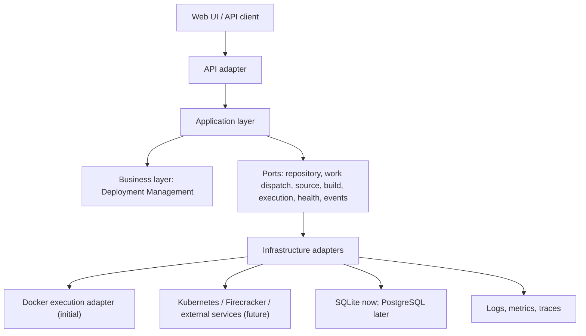
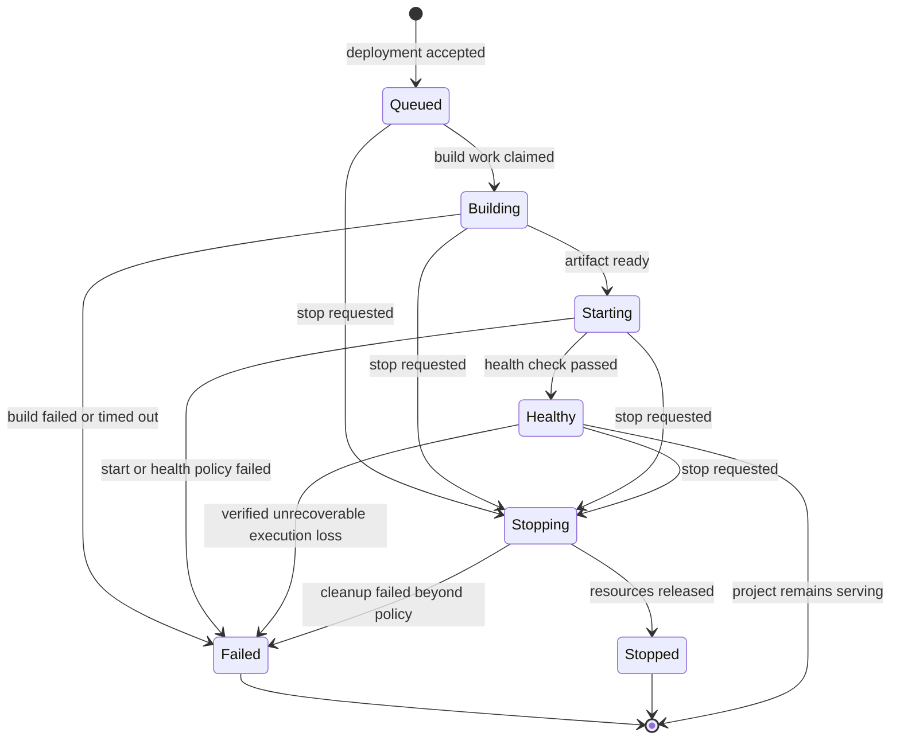

# RFC-0001: Deployment Management Architecture

| Field | Value |
| --- | --- |
| RFC ID | RFC-0001 |
| Status | Accepted |
| Owners | DocAI Cloud Platform Engineering |
| Reviewers | Backend, Platform, Security, and Product Engineering |
| Created | 2026-07-14 |
| Last updated | 2026-07-14 |
| Decision deadline | Before the first persistent deployment implementation |

## 0. Document Information

### Decision

DocAI Cloud will model a deployment as a project-owned historical record whose identity and input are immutable, with a separately controlled current status projection. Deployment Management owns its lifecycle and exposes its current state through a finite state machine. A Deployment Orchestrator, in the application layer, coordinates work through ports. An Execution Environment is one such port: Docker is the initial adapter and is not part of the business model.

### Reading guide

Normative language follows RFC 2119: **MUST**, **MUST NOT**, **SHOULD**, and **MAY** carry their usual meanings. This document describes architecture and contracts, not framework, ORM, schema-migration, or process-command choices.

### Architecture principles

1. **The domain is infrastructure-agnostic.** Business entities and their state transitions MUST NOT contain Docker, Kubernetes, image, container, pod, or provider identifiers.
2. **History is append-only.** A deployment records one attempt against one immutable release input. A later attempt is a new deployment, never an edit of an earlier one.
3. **State is explicit and validated.** Deployment Status is the current, query-optimized projection of an authoritative lifecycle; transitions are controlled by one state machine.
4. **Commands cause change; events record facts.** Commands express intent, while Deployment Events record facts that were accepted by the domain.
5. **Asynchrony is contained at boundaries.** Request handling creates or requests work; long-running work occurs outside the request path and is made observable through state and events.
6. **Ports are stable; adapters are replaceable.** Providers may change without changing Project, Deployment, Deployment Event, or lifecycle semantics.
7. **Ownership precedes optimization.** Each datum has one authoritative owner, and derived views are explicitly rebuildable.

---

# 1. Introduction

## 1.1 Abstract

DocAI Cloud is a platform for taking an application selected by a user and making a defined version of it available under platform control. This RFC defines the foundation for that capability: Deployment Management.

The design separates the business decision that a project has a deployment from the mechanics used to build and run it. The platform records immutable deployment history, maintains a single current Deployment Status, and emits durable Deployment Events. An application-layer Deployment Orchestrator translates lifecycle work into calls to replaceable infrastructure adapters, including the initial Docker-backed Execution Environment.

This boundary is deliberate. Docker can accelerate the MVP, but it is not the platform's architecture. The same domain model must support a future Kubernetes scheduler, Firecracker-based isolation, external build service, workers, domains, scaling, and rollbacks without redefining what a deployment is.

## 1.2 Motivation

Deploying an application is neither a single request nor a single infrastructure operation. It is a long-running business workflow with ownership, authorization, auditable history, failure handling, and user-visible progress. Treating it as a controller method that starts a Docker container makes the first demo easy but bakes provider details into every future feature.

DocAI Cloud needs a stable answer to the following questions from its first release:

- Which exact project input was requested to run?
- Which attempt produced the currently serving version, and what happened in prior attempts?
- What is happening now, who requested it, and why did it fail or stop?
- Which component is permitted to change lifecycle state?
- How can a different execution provider honor the same platform behavior?

The answer must work first with FastAPI, React, TypeScript, SQLite, and Docker, while avoiding an MVP-specific model that precludes PostgreSQL, queues, multiple providers, or durable observability.

## 1.3 Problem statement

Without a deployment domain, infrastructure-side effects become the source of truth. That creates several failures of design:

- a deleted or renamed provider object destroys user history;
- a transient provider status is mistaken for a product lifecycle state;
- retries overwrite the evidence required to investigate an earlier failure;
- APIs cannot safely distinguish a request to deploy from a request to stop;
- a later provider requires invasive changes across projects, APIs, and persistence;
- logs have no durable business owner or authorization boundary.

The platform needs a bounded context that owns deployment intent, lifecycle, history, and policy, without owning provider implementation details.

## 1.4 Goals

This RFC establishes an architecture that MUST:

- represent Projects as long-lived entities and Deployments as historical attempts with immutable facts and controlled status progression;
- give every Deployment one validated current Deployment Status and an append-only Deployment History;
- make lifecycle transitions deterministic, idempotent, auditable, and safe under retries;
- keep business concepts independent of the initial Docker adapter and any future provider;
- support asynchronous execution, recovery after process failure, and eventual provider reconciliation;
- define clear ownership boundaries for source, builds, execution, health, logs, and user-facing deployment state;
- provide extension points for queues, workers, rolling releases, domains, scaling, and rollbacks.

## 1.5 Non-goals

This RFC does not select:

- a buildpack, language-detection, artifact format, container-image strategy, or source-control provider;
- a Kubernetes, Firecracker, or multi-region implementation;
- detailed autoscaling, traffic-shaping, billing, or quota algorithms;
- CI/CD pipelines, release approvals, or environment promotion policy;
- a log-storage vendor or a search/query language;
- exact HTTP payloads, database DDL, ORM mappings, or background-job framework;
- zero-downtime or atomic cutover guarantees for the MVP.

Those decisions must conform to this RFC when introduced; they are not implicitly approved by it.

---

# 2. Core Concepts

The following terms are normative and MUST be used consistently in product, API, and implementation discussions.

| Term | Definition | Important distinction |
| --- | --- | --- |
| **Project** | A long-lived, user-owned application definition and its deployment policy/configuration. | A Project is not a running application and does not become historical when deployments change. |
| **Deployment** | One historical request to make one resolved Project input available for execution. Its identity, initiator, and input are immutable; only its controlled current status projection advances. | It is not a mutable slot named “production.” |
| **Deployment Management** | The bounded context that owns deployment lifecycle, history, transition policy, and deployment-facing authorization. | It does not execute workloads itself. |
| **Deployment Orchestrator** | An application service that advances accepted deployment work by calling ports and reporting resulting facts to Deployment Management. | It coordinates; it is not the source of lifecycle policy. |
| **Execution Environment** | An infrastructure capability that provisions, starts, stops, inspects, and releases an executable workload. | Docker is one implementation; an environment is neither a domain entity nor synonymous with a container. |
| **Deployment Status** | The current lifecycle state of a Deployment, constrained by the state machine in this RFC. | It is a projection of the latest accepted lifecycle fact, not an event stream. |
| **Deployment Event** | An immutable, ordered business fact about a Deployment, recorded after the domain accepts it. | Events explain history; they are not unstructured logs. |
| **Deployment History** | The ordered set of a Deployment's events plus immutable deployment input and terminal outcome. | History is never rewritten to make an earlier attempt look successful. |
| **Release input** | The fully resolved, reproducible source and configuration identity used for a deployment attempt. | A mutable branch name alone is insufficient; it must resolve to a revision or immutable equivalent. |
| **Build** | Preparation that transforms release input into an executable artifact or reports failure. | A build is a capability/stage, not a replacement name for Deployment. |
| **Artifact** | An immutable output of build preparation that an Execution Environment can consume. | Artifact format belongs to infrastructure integration, not the Deployment entity. |
| **Health check** | A policy-driven verification that a started workload is able to serve its intended purpose. | A provider saying “started” is not proof of health. |
| **Log record** | An operational observation emitted by build or execution work. | Logs may be high volume and mutable in retention; they do not define business state. |
| **Reconciliation** | Comparison of intended/recorded deployment state with observed provider state, followed by safe corrective action. | It handles missed callbacks and restarts; it does not bypass the state machine. |

### Source of truth

Deployment Management is authoritative for deployment intent, Deployment Status, and Deployment Events. An Execution Environment is authoritative only for its own observed provider resources. A discrepancy is resolved through reconciliation and recorded events; provider metadata MUST NOT silently overwrite deployment history.

---

# 3. Domain Model

## 3.1 Bounded contexts and ownership

Deployment Management is a bounded context. It references identities from adjacent contexts but does not duplicate their rules.

| Context | Owns | Deployment Management consumes |
| --- | --- | --- |
| Identity and Access | users, organizations, memberships, roles | actor and tenant identity; authorization decision inputs |
| Project Management | Project identity, source connection, deployable configuration, environment policy | immutable Project snapshot needed by a Deployment |
| Deployment Management | Deployment, Deployment Status, Deployment Event, lifecycle policy | authoritative deployment history and intent |
| Build Service (future) | build execution, artifact production, build-specific observations | immutable artifact reference and build outcome |
| Execution Environment | provider resources and observed workload state | opaque execution reference and provider observations |
| Observability | log records, metrics, traces, retention/query capability | deployment correlation identity and authorized access boundary |
| Routing and Domains (future) | domain ownership and traffic bindings | a ready target reference and lifecycle signals |

This separation prevents the deployment aggregate from absorbing source-control, billing, networking, or provider concerns merely because those concerns interact during deployment.

## 3.2 Entities and value objects

### Project

A Project has stable identity, ownership, and a configurable desired deploy policy. It may be archived, but its historical deployments remain accessible according to retention policy. A Project may have zero or many Deployments.

Project configuration is mutable over time. A Deployment therefore records an immutable **deployment specification snapshot** sufficient to explain the intent at its creation: resolved release input, relevant execution and health policy, and configuration version. Changes made to a Project after deployment creation MUST NOT reinterpret a previous deployment.

### Deployment

A Deployment is the aggregate root for a single attempt. Its historical facts are immutable; its current status and controlled integration correlations evolve only through valid lifecycle work. It contains no provider-specific fields as part of its domain identity. Its minimum business facts are:

| Fact | Why it belongs to Deployment |
| --- | --- |
| Deployment identity and Project identity | establishes ownership and stable references |
| requester/initiator identity and request reason | supports authorization, support, and audit |
| immutable deployment specification snapshot | makes the attempt reproducible and historically intelligible |
| current Deployment Status | provides efficient current-state reads and controls permitted commands |
| creation, terminal, and last-transition times | supports ordering, recovery, and operational analysis |
| terminal reason classification, when applicable | explains an outcome without parsing logs |
| opaque external references, when produced | permits correlation without making provider identifiers part of the domain |

The Deployment aggregate validates commands and produces lifecycle facts. It MUST NOT build, start, poll, invoke a health endpoint, or directly store log streams.

### Deployment specification snapshot

The snapshot is a value object captured before asynchronous work begins. It includes only the values that influence this attempt, for example source revision, source descriptor version, application start intent, exposed service intent, health policy, and selected execution class. It MUST be versioned so later configuration evolution can be interpreted without guessing.

Secrets are referenced by versioned opaque handles, never copied into the snapshot or Deployment Event payloads. If a secret changes, an existing deployment continues to reference the version it was created with; a new deployment captures the new reference.

### Deployment Event

A Deployment Event is immutable and belongs to exactly one Deployment. It has a stable event identity, a per-deployment monotonic sequence, event type, occurrence time, actor/correlation metadata, and a safe structured payload. Its payload is schema-versioned and MUST exclude credentials and arbitrary log output.

### Deployment History

Deployment History is a domain read of immutable Deployment data and events in sequence order. It must remain coherent even when an Execution Environment resource no longer exists. History answers “what did the platform decide and observe?”; it does not promise byte-for-byte provider telemetry.

## 3.3 Aggregate invariants

1. A Deployment belongs to one Project for its entire lifetime.
2. A Deployment's specification snapshot, initiator, and release input are immutable after creation.
3. A Deployment Status is always one member of the finite set defined in Section 5.
4. Only a valid transition may change Deployment Status; terminal deployments cannot re-enter active states.
5. Every accepted status transition MUST atomically append its corresponding outcome Deployment Event in the same logical change. Additional non-transition facts MAY be appended in that ordered change.
6. A Deployment has at most one active execution allocation at a time. Retried provider operations reuse an idempotency key; a new deployment is required for a fresh attempt.
7. Deployment Events are append-only and strictly ordered within a Deployment; timestamps alone are not ordering authority.
8. Provider references and operational metadata are opaque correlations. Their loss or mutation MUST NOT invalidate deployment history.

## 3.4 Explicitly excluded from the domain entity

Container IDs, image names, pod names, namespaces, node addresses, Docker exit codes, and raw provider statuses are infrastructure observations. They may be retained behind an adapter and surfaced through authorized diagnostics, but they MUST NOT become required business fields or state-machine inputs without normalization at the boundary.

---

# 4. Architecture

## 4.1 Layered architecture

The architecture uses dependency direction, not deployment topology, to protect the domain. Dependencies point inward: infrastructure adapters depend on application contracts; application services depend on domain policy; the domain depends on neither.



### Business layer

The business layer contains Project-facing deployment policy, the Deployment aggregate, transition validation, event definitions, and business error classifications. It has no HTTP, database, queue, or provider dependency. Its central responsibility is to decide whether a requested change is valid and record the fact that it occurred.

### Application layer

The application layer implements use cases: request deployment, advance a deployment, report a normalized outcome, stop a deployment, inspect history, and reconcile outstanding work. It loads aggregates, authorizes commands using policy supplied by Identity and Access, invokes the domain, persists a consistent result, and asks ports to perform external work.

The Deployment Orchestrator lives here. It coordinates stages but MUST request all status changes through the domain. It is restartable: a worker may stop between calls without losing the durable state from which work can resume.

### Infrastructure layer

Infrastructure adapters implement ports for persistence, message dispatch, source resolution, build execution, Execution Environment operations, health probing, logs, and external APIs. An adapter converts its technology's vocabulary into normalized application outcomes. Provider-specific retry mechanics and error codes stay here.

## 4.2 Work dispatch and atomicity boundary

Creating a Deployment and recording its initial event MUST be one durable business change. Dispatching asynchronous orchestration MUST be reliably coupled to that change, using an outbox-equivalent pattern or another mechanism with the same guarantee: no accepted deployment is silently lost because the process failed between persistence and dispatch.

Delivery is at-least-once. Therefore command handlers, the Orchestrator, and adapters MUST be idempotent by deployment identity plus stage/operation key. Exactly-once provider execution is neither assumed nor required; duplicate side effects are prevented or safely recognized at the provider boundary.

## 4.3 Consistency model

Within one Deployment aggregate, state and its event are strongly consistent. Calls to source, build, execution, health, logs, routing, and queue systems are eventually consistent. The product surface MUST show current known Deployment Status and meaningful transition time rather than claiming a globally synchronous view.

## 4.4 Failure containment

External work MUST have time bounds, cancellation semantics, and normalized failure categories. A provider timeout is an observation requiring retry or reconciliation, not immediate proof that a workload never started. The Orchestrator records an explicit pending/uncertain fact where needed and only declares a terminal failure once policy has exhausted safe recovery.

---

# 5. Deployment State Machine

## 5.1 States

The finite state machine represents product lifecycle, not raw provider state. `Queued`, `Building`, and `Starting` are active states; `Healthy`, `Failed`, and `Stopped` are stable states. `Stopping` exists to make user intent and cleanup visible.

| Status | Category | Meaning |
| --- | --- | --- |
| `Queued` | active | Deployment was accepted and awaits orchestration. |
| `Building` | active | Release input is being prepared into an executable artifact. |
| `Starting` | active | An Execution Environment is being asked to create/start the workload. |
| `Healthy` | stable serving | The workload started and passed the configured health policy. |
| `Stopping` | active | A stop was requested; the platform is releasing execution resources. |
| `Stopped` | terminal | The deployment was intentionally stopped or completed non-failure shutdown. |
| `Failed` | terminal | The attempt cannot become healthy under current policy. |

`Healthy` is intentionally the only serving state. If a future provider exposes a workload as “running” before health verification, that observation maps to `Starting`, not `Healthy`.

## 5.2 Valid transitions



The last `Healthy --> [*]` marker means a healthy deployment may remain in that status indefinitely; it is not a terminal state because it may be stopped. It MAY transition to `Failed` only after reconciliation confirms unrecoverable execution loss under declared policy. It MUST NOT transition to `Failed` on an isolated health-probe failure. Degradation policy is a future extension and must first define thresholds, reconciliation, and user semantics.

## 5.3 Transition authority and required facts

| Transition | Authorized trigger | Required recorded fact |
| --- | --- | --- |
| create → `Queued` | accepted deploy command | `DeploymentRequested` |
| `Queued` → `Building` | Orchestrator claims work | `BuildStarted` |
| `Building` → `Starting` | build outcome accepted | `BuildSucceeded` (with artifact correlation) |
| `Building` → `Failed` | normalized build failure | `DeploymentFailed` with `build_failure` category |
| `Building` → `Failed` | release input cannot be retrieved under policy | `DeploymentFailed` with `source_failure` category |
| `Starting` → `Healthy` | health outcome accepted | `HealthCheckPassed` and `DeploymentBecameHealthy` |
| `Starting` → `Failed` | normalized start/health failure | `DeploymentFailed` with relevant category |
| `Healthy` → `Failed` | reconciled irrecoverable execution loss | `DeploymentFailed` with `execution_failure` category |
| active/healthy → `Stopping` | authorized stop command or policy | `StopRequested` |
| `Stopping` → `Stopped` | release outcome accepted | `DeploymentStopped` |
| `Stopping` → `Failed` | terminal cleanup failure | `DeploymentFailed` with `cleanup_failure` category |

An implementation may record additional non-transition events, but every status change requires the fact shown above. If a single business action produces multiple events, their order is defined by the per-deployment sequence.

## 5.4 Invariants and concurrency rules

- State transitions MUST compare against the expected current version/status. Competing workers may not both advance a deployment.
- An operation that is retried after a durable transition MUST be treated as a no-op success when the desired postcondition already holds.
- Stop has precedence over normal advancement. After `Stopping` is recorded, no later build, start, or health outcome may promote the deployment to `Healthy`.
- A late outcome from an obsolete operation is recorded only as a diagnostic event when useful; it MUST NOT regress or revive status.
- Terminal states are irreversible. Redeployment creates a new Deployment linked by a non-mutating lineage relationship.
- The platform MUST enforce any Project policy limiting concurrent active deployments at command acceptance or orchestration claim time. The policy is explicit and may evolve; it is not implied by provider capacity.

## 5.5 Failure rules

Failures are classified, not inferred from display text. Initial categories are `source_failure`, `build_failure`, `execution_failure`, `health_check_failure`, `cleanup_failure`, `policy_rejection`, and `platform_failure`. Each records a safe user message, a stable category, and a diagnostic correlation ID. Raw provider error details remain in protected diagnostics.

Failure to observe an outcome is handled as uncertainty. The Orchestrator retries only operations designed as idempotent, then reconciles the Execution Environment. It transitions to `Failed` only when configured time/retry policy determines the desired state cannot be achieved or safely established. This avoids both false failure and unbounded “starting” states.

---

# 6. Event Model

## 6.1 Why events exist

Deployment Status answers “what is the current lifecycle state?” Deployment Events answer “what happened, in what order, and why?” Both are needed. A mutable status alone loses evidence; events alone make the common current-state query expensive and fragile.

Events support user-visible history, support investigation, audit trails, retry/reconciliation diagnostics, and future analytics. They are domain records, not an assertion that the system uses event sourcing. The current status remains a first-class stored projection with transactional linkage to each transition.

## 6.2 Event envelope

Every event MUST carry:

- immutable event ID and event schema version;
- Deployment ID, Project ID, and monotonically increasing deployment sequence;
- event type and occurrence timestamp;
- initiating actor or system actor, request/correlation ID, and causation ID when applicable;
- safe structured details appropriate to the event type.

Events are immutable. Corrections are represented by later facts, never by editing an earlier event. Payload schemas are additive where possible; incompatible semantics require a new event type or versioned interpretation.

## 6.3 Event taxonomy

| Family | Examples | Purpose |
| --- | --- | --- |
| Intent | `DeploymentRequested`, `StopRequested`, `RedeployRequested` | captures an accepted user or system decision |
| Progress | `BuildStarted`, `BuildSucceeded`, `ExecutionStartRequested` | explains advancement without exposing provider internals |
| Verification | `HealthCheckPassed`, `HealthCheckFailed` | records health policy outcomes |
| Outcome | `DeploymentBecameHealthy`, `DeploymentStopped`, `DeploymentFailed` | records consequential lifecycle result |
| Recovery | `ReconciliationStarted`, `OperationRetried`, `ProviderStateObserved` | makes asynchronous recovery inspectable |
| Policy | `DeploymentRejected`, `ConcurrentDeploymentLimited` | explains policy decisions without fabricating an attempt |

`DeploymentRejected` occurs before a Deployment may exist where policy requires no record; product audit policy will determine whether rejected commands are retained separately. It is not a substitute for a failed deployment.

## 6.4 Events versus logs

| Property | Deployment Event | Log record |
| --- | --- | --- |
| Meaning | durable, named business fact | operational diagnostic output |
| Volume | low and bounded | potentially high and unbounded |
| Ordering | strict per Deployment | best-effort; timestamps/streams may interleave |
| Retention | long-lived audit/history policy | independent operational retention policy |
| State authority | may accompany a status transition | never directly changes Deployment Status |
| Sensitive data | deliberately minimized | must be redacted and access-controlled |

The UI may present events and logs in a unified timeline, but it MUST preserve their distinction. A log message such as “server listening” cannot make a deployment `Healthy`; an accepted health outcome can.

## 6.5 Extensibility

External consumers must use versioned event contracts delivered from a durable outbox or equivalent. They must be idempotent and tolerate reordering across different Deployments. This permits future notifications, analytics, billing, routing, and audit sinks without coupling them to the Orchestrator transaction.

---

# 7. Sequence Diagrams

These diagrams show responsibility boundaries, not synchronous call guarantees. Durable state changes occur before or with reliable dispatch; external calls may complete later.

## 7.1 Successful deployment

```mermaid
sequenceDiagram
  actor User
  participant API as API adapter
  participant DM as Deployment Management
  participant Q as Work dispatch
  participant O as Deployment Orchestrator
  participant B as Build capability
  participant EE as Execution Environment
  participant H as Health capability
  User->>API: Request deployment
  API->>DM: Authorize and create deployment
  DM-->>API: Queued + DeploymentRequested
  DM->>Q: Reliably dispatch deployment work
  Q->>O: Deliver work (at least once)
  O->>DM: Claim build; record BuildStarted
  O->>B: Prepare resolved release input
  B-->>O: Artifact reference
  O->>DM: Record BuildSucceeded; move to Starting
  O->>EE: Start artifact using execution specification
  EE-->>O: Opaque execution reference
  O->>H: Verify health using policy
  H-->>O: Passed
  O->>DM: Record health facts; move to Healthy
```

## 7.2 Failed deployment

```mermaid
sequenceDiagram
  participant O as Deployment Orchestrator
  participant DM as Deployment Management
  participant B as Build capability
  O->>DM: Claim build; Building
  O->>B: Prepare release input
  B-->>O: Normalized build failure
  O->>DM: Record DeploymentFailed(build_failure)
  DM-->>DM: Status becomes Failed; history remains immutable
```

## 7.3 Health check failure

```mermaid
sequenceDiagram
  participant O as Deployment Orchestrator
  participant EE as Execution Environment
  participant H as Health capability
  participant DM as Deployment Management
  O->>EE: Start workload
  EE-->>O: Execution reference
  loop Until policy succeeds, times out, or is cancelled
    O->>H: Perform health check
    H-->>O: Failed observation
    O->>DM: Record HealthCheckFailed
  end
  O->>EE: Release workload after policy failure
  O->>DM: Record DeploymentFailed(health_check_failure); Failed
```

## 7.4 Manual stop

```mermaid
sequenceDiagram
  actor User
  participant API as API adapter
  participant DM as Deployment Management
  participant O as Deployment Orchestrator
  participant EE as Execution Environment
  User->>API: Stop healthy deployment
  API->>DM: Authorize stop; record StopRequested
  DM-->>API: Stopping
  API->>O: Reliably dispatch stop work
  O->>EE: Release execution allocation
  EE-->>O: Released or already absent
  O->>DM: Record DeploymentStopped; Stopped
```

## 7.5 Future redeploy

```mermaid
sequenceDiagram
  actor User
  participant DM as Deployment Management
  participant O as Deployment Orchestrator
  User->>DM: Request redeploy of a Project / prior deployment
  DM->>DM: Resolve current or selected immutable release input
  DM-->>User: New Deployment in Queued; lineage recorded
  O->>O: Orchestrate the new deployment independently
  Note over DM: Earlier Deployment and events are never changed
```

---

# 8. Database Design

Database design follows the domain model; it does not define it. SQLite is acceptable for local/MVP persistence if it preserves the following logical guarantees. PostgreSQL adoption must retain these contracts.

## 8.1 Logical records and ownership

| Logical record | Owner | Required purpose |
| --- | --- | --- |
| Project | Project Management | long-lived application identity and mutable configuration |
| Deployment | Deployment Management | immutable attempt facts and current status projection |
| Deployment Event | Deployment Management | append-only ordered history and audit facts |
| Work dispatch record | application/integration boundary | durable handoff from accepted state to asynchronous work |
| External operation record | infrastructure integration | idempotency, attempts, opaque provider correlation, and reconciliation state |
| Artifact reference | Build capability | immutable build output metadata and retention linkage |
| Log record/index | Observability | high-volume diagnostics correlated to Deployment |

The Deployment record MAY include a compact latest-event sequence and status version to support concurrency control. The event record MUST have a uniqueness constraint on `(deployment_id, sequence)`. The system MUST ensure that appending a transition event and updating current status commit atomically.

## 8.2 Field rationale

| Deployment field category | Why it exists | Mutability |
| --- | --- | --- |
| identity, Project/tenant reference | ownership, authorization, joins | immutable |
| requester and trigger metadata | audit and support | immutable |
| specification snapshot/version and resolved revision | reproducibility and correct history | immutable |
| status, version, last-transition time | fast state reads and optimistic concurrency | transition-controlled |
| terminal category/message/correlation | safe outcome display and diagnostics lookup | written once on terminal outcome |
| lineage reference | future redeploy/rollback relationship | immutable when present |
| opaque provider/artifact correlations | integration and reconciliation | controlled by application/integration boundary |

Large payloads, raw logs, credentials, arbitrary provider responses, and mutable Project configuration MUST NOT be stored as Deployment Events merely for convenience. They have different ownership, retention, and access requirements.

## 8.3 Retention and deletion

Project deletion must be modeled as a lifecycle and retention policy, not an unbounded cascade. Deployment History is an audit and support asset and SHOULD remain available in a tombstoned/redacted form for the configured retention period. Secret values are never retained in it. Provider resource cleanup may precede history deletion.

## 8.4 Query model

The primary query paths are: deployments for a Project ordered by creation, a single deployment with current status, events for a deployment ordered by sequence, active deployments needing reconciliation, and externally correlated operations. Derived read models for dashboards or analytics MUST be rebuildable from owned records and may lag lifecycle state.

---

# 9. API Design

The API is a boundary over use cases, not a mirror of tables or provider commands. It MUST use stable deployment identities, explicit command semantics, tenant authorization, idempotency keys for mutating requests, and optimistic-concurrency/precondition mechanisms where a caller acts on current state.

| Capability | Illustrative resource/action | Semantics |
| --- | --- | --- |
| Request deployment | `POST /projects/{projectId}/deployments` | resolves deploy input, creates a new Deployment, returns `Queued`; never overwrites an earlier one |
| List history | `GET /projects/{projectId}/deployments` | paginated deployment summaries ordered by a documented stable cursor |
| Inspect deployment | `GET /deployments/{deploymentId}` | immutable input summary, current status, safe terminal reason, links to related data |
| Inspect events | `GET /deployments/{deploymentId}/events` | ordered immutable Deployment History events |
| Stop deployment | `POST /deployments/{deploymentId}/stop` | requests stop; returns current/accepted `Stopping` or an idempotent terminal response |
| Redeploy | `POST /deployments/{deploymentId}/redeploy` | creates a **new** deployment with explicit source/config selection and lineage |
| Read logs | `GET /deployments/{deploymentId}/logs` | delegates to Observability under identical authorization; logs are not events |

Long-running endpoints return an accepted resource representation rather than hold a connection until build/execution completes. Status updates may be polled or streamed from the event model. API error responses distinguish invalid transition, authorization denial, validation/policy rejection, and transient platform failure; they do not expose provider internals or secrets.

---

# 10. Service Design

## 10.1 Responsibilities and boundaries

| Component | Owns | Must not own |
| --- | --- | --- |
| Deployment command service | authorization-aware use cases, aggregate persistence, reliable work dispatch | provider calls, health probing, log ingestion |
| Deployment Orchestrator | stage coordination, retries, timeouts, normalized outcome reporting, recovery scheduling | transition policy, tenant authorization decisions, durable log storage |
| Deployment state machine | allowed transitions, invariants, event production | queues, timeouts, provider APIs |
| Source resolver | pinning/obtaining release input | Deployment Status changes |
| Build capability | build work and artifact result | Project history or execution lifecycle |
| Execution Environment port | start/stop/inspect/release workload with opaque references | Project/Deployment persistence or user-facing lifecycle policy |
| Health capability | execute declared health policy and report observations | deciding the final Deployment Status |
| Reconciler | find outstanding/uncertain operations and request safe continuation | bypassing aggregate versioning or fabricating success |
| Observability service | logs, metrics, traces and correlation | lifecycle transition authority |

## 10.2 Interaction contract

Adapters return normalized results: success with opaque correlation, retryable failure, non-retryable failure, or uncertain outcome requiring reconciliation. The application layer maps these into domain commands/events according to policy. No adapter is permitted to write Deployment Status directly.

Each stage has a durable operation identity. It includes the Deployment, operation kind, and attempt/idempotency token. This makes a restarted worker safe and makes observability explain *which* request created a provider resource. The resource allocation is a lease owned by the deployment operation; cleanup is idempotent and must occur on cancellation, terminal failure after allocation, and normal stop.

## 10.3 Reconciliation

The reconciler runs independently of request traffic. It scans active deployments whose progress deadline has elapsed, operations with uncertain outcomes, and allocations requiring cleanup. It observes the relevant port, records a diagnostic fact, and asks the aggregate to accept only a valid next transition. It never infers `Healthy` solely from resource existence.

---

# 11. Infrastructure Integration

## 11.1 Execution Environment port

The application layer requires capability-oriented operations: allocate/start an executable artifact from an execution specification, request release, inspect a known allocation, and optionally receive normalized lifecycle observations. The port returns an opaque execution reference; its format is owned by the adapter.

An execution specification is a provider-neutral intent: artifact reference, resource class, declared ports, environment-secret references, execution timeout, and isolation class. It MUST NOT expose Docker command syntax, Kubernetes manifests, or provider labels as required domain fields. Provider-specific extensions, if ever necessary, are versioned configuration at the infrastructure boundary and require an explicit compatibility policy.

## 11.2 Docker adapter (initial)

The initial Docker adapter implements the Execution Environment port. It translates provider-neutral execution intent into Docker operations, maintains its opaque correlation mapping, normalizes errors, and emits logs/metrics to Observability. It may use Docker-specific metadata internally for reconciliation. None of that metadata changes the meaning of Project, Deployment, Deployment Status, or Deployment Event.

## 11.3 Replacing or adding providers

A Kubernetes adapter can implement the same port using its own resource mapping; a Firecracker adapter can implement it using VM allocations. Migration is phased: new deployments select a supported execution class/provider by policy; existing allocations remain managed by the adapter that created them until stopped. The Deployment History retains provider-neutral facts and opaque diagnostic correlation, so historical reads do not require a provider migration.

## 11.4 Other replaceable integrations

Source-control clients, build executors, queues, persistence engines, secret stores, log stores, and health-check implementations are also adapters. Replacing SQLite with PostgreSQL is a persistence-adapter migration that must preserve transaction, ordering, uniqueness, and outbox guarantees; it must not alter lifecycle semantics.

---

# 12. Security Considerations

## 12.1 Authentication and authorization

Every deployment command and read is scoped to a tenant and authorized against Project ownership/membership. Authorization is checked at the application boundary and rechecked by internal consumers where work is tenant-sensitive. Possession of a Deployment ID is never authority. Service-to-service calls use distinct workload identities and least privilege.

## 12.2 Secrets and sensitive configuration

Secrets are stored and resolved through a dedicated secret-management capability. Deployment records/events contain only secret references and immutable version identifiers. Secret values MUST NOT appear in API responses, event payloads, provider metadata visible to untrusted users, logs, traces, error messages, or support exports. Rotation creates new references for future deployments and follows a separate policy for running workloads.

## 12.3 Execution isolation

The Execution Environment is responsible for workload isolation, resource limits, filesystem/network policy, and credential injection. The domain states the required isolation class; the adapter enforces it. User workloads MUST NOT receive platform control-plane credentials. Default-deny network and explicit egress policy are the intended direction, though detailed network design is out of scope.

## 12.4 Auditability and integrity

Deployment Events provide append-only lifecycle audit. Administrative actions, manual stops, redeploys, policy overrides, and access to sensitive diagnostics require actor and correlation attribution. Database permissions and service boundaries MUST prevent infrastructure adapters from mutating deployment history directly. Event payload validation and schema versioning protect against injection of arbitrary/sensitive fields.

## 12.5 Supply-chain and input safety

Resolved source revisions and artifacts must be integrity-addressable where supported. Build/execution adapters must treat source, build output, and user configuration as untrusted input. Provider callbacks are authenticated, correlated to a known operation, and idempotently processed; an unsolicited callback cannot advance a deployment.

---

# 13. Future Evolution

| Capability | How this architecture enables it | Constraint to preserve |
| --- | --- | --- |
| Kubernetes | add an Execution Environment adapter and provider-selection policy | no Kubernetes types in domain entities/events |
| Firecracker or other isolation | implement the execution port with a new allocation model | opaque references and normalized outcomes remain valid |
| Build queues | dispatch build stages to independent workers | stage operation identity and at-least-once safety remain intact |
| Background workers | model worker process intent in the immutable specification | worker execution does not redefine Deployment lifecycle |
| Scaling | introduce desired replica policy and allocation set beneath execution integration | `Healthy` semantics must remain clear for one or many allocations |
| Custom domains | add Routing and Domains bindings to a healthy target | routing ownership stays outside Deployment Management |
| Rollbacks | create a new deployment from an earlier immutable specification/artifact | rollback never changes the failed or prior deployment |
| Traffic strategies | add a release/traffic context above individual deployments | deployment history is not overwritten by promotion state |
| Analytics | consume versioned events into derived models | analytics is non-authoritative and replayable |
| PostgreSQL | migrate persistence adapter for concurrency and durability | event/status atomicity and sequence uniqueness are preserved |

Two future concepts require separate RFCs before implementation: a **Release** (a higher-level set of deployments and promotion intent) and a **Service** (a routable/scalable runtime unit). Neither is introduced prematurely here because neither is necessary to preserve correct Deployment semantics.

---

# 14. Alternatives Considered

## 14.1 Make Docker the deployment model

Rejected. A Docker container is a provider resource with lifecycle details that do not map cleanly to Kubernetes pods, microVMs, or external execution services. Using its ID and status as product state leaks implementation, makes history fragile, and forces future migrations through every layer.

## 14.2 Keep only one mutable deployment record per Project

Rejected. It loses historical intent and failures, makes audit/support impossible, turns retry into destructive update, and makes rollback ambiguous. Projects are long-lived; deployment attempts are historical.

## 14.3 Derive state entirely from provider polling

Rejected. Provider observations are incomplete, transient, provider-specific, and do not include business intent such as manual stop or policy rejection. Polling is valuable for reconciliation, not as the deployment domain's sole source of truth.

## 14.4 Event-source the entire deployment domain now

Rejected for the MVP. Full event sourcing adds projection versioning, replay, migration, and operational complexity before there is a demonstrated need. This RFC keeps append-only events and an atomically maintained status projection, retaining auditability and future extensibility without making event replay the only persistence model.

## 14.5 Use a generic asynchronous job status as Deployment Status

Rejected. Build and execution work are jobs; a deployment is a customer-visible business lifecycle. Conflating them makes stop, health, history, provider replacement, and future release policy difficult to express.

## 14.6 Permit arbitrary status updates from workers/adapters

Rejected. It creates races, invalid histories, and inconsistent policy enforcement. Normalized observations must flow through application services and the aggregate state machine.

---

# 15. Acceptance Criteria

RFC-0001 is complete when the implementation design and subsequent work demonstrate all of the following:

1. The published ubiquitous language uses the terms in Section 2; provider-specific names do not stand in for domain concepts.
2. A Project can own many Deployment attempts with immutable historical facts; creating, retrying, redeploying, or rolling back always creates a new Deployment.
3. Every Deployment persists a resolved immutable input/specification snapshot, current Deployment Status, and ordered immutable Deployment Events.
4. The status transition table is implemented as the sole authority for lifecycle changes, including terminal-state and stop-precedence rules.
5. Each accepted status transition atomically records the corresponding event, and duplicate/late work cannot corrupt history or create a second active allocation.
6. Long-running work is reliably dispatched after deployment acceptance, is safe under at-least-once delivery, and has reconciliation for incomplete/uncertain operations.
7. The Docker implementation is an Execution Environment adapter behind a provider-neutral port; no Docker type, identifier, or status is required by business entities or public lifecycle semantics.
8. Events and logs have separate storage/retention/authorization contracts and neither logs nor raw provider status can directly change Deployment Status.
9. APIs expose deployment commands, current state, and immutable history without blocking on build or execution completion, leaking secrets, or exposing infrastructure internals.
10. The persistence design preserves ordering, atomic event/status changes, tenant authorization boundaries, idempotency, and outbox-equivalent reliable dispatch when moving from SQLite to PostgreSQL.
11. Security review confirms secret references—not values—are captured; execution isolation and least-privilege adapter access are explicitly owned; and lifecycle actions are auditable.
12. A design review can describe how Kubernetes, a queue-backed build worker, custom domains, scaling, and rollback attach to the architecture without changing the Deployment aggregate's core meaning.

---

# Appendix A: Architectural Review Record

This RFC was reviewed against the stated goals before publication. The following issues were identified and resolved in the document.

| Review question | Risk found in early framing | Resolution in this RFC |
| --- | --- | --- |
| Is Docker becoming the architecture? | Provider identifiers and “running container” language could leak into lifecycle. | Sections 2, 3, and 11 make Execution Environment a port; provider references are opaque correlations. |
| Can history be rewritten by retries or cleanup? | Mutable attempts would erase failure evidence. | Deployment facts, events, snapshots, terminal outcomes, and lineage are append-only/immutable; status progresses only through the FSM. |
| Can asynchronous work lose or duplicate deployments? | Request/queue gap and worker retries can cause missing or double work. | Section 4 requires reliable dispatch and idempotent operation identities; Section 10 assigns reconciliation. |
| Is “running” ambiguous? | Provider running state is not user-serving health. | The public FSM has `Starting` and `Healthy`; only health verification produces serving state. |
| Are events being confused with logs? | High-volume, sensitive output could be made authoritative history. | Section 6 defines distinct semantics, retention, and authority. |
| Does the design prematurely introduce releases/services? | Extra aggregates could obscure the MVP's actual domain. | They are deferred explicitly as future RFCs while preserving extension points. |
| Could stop race with health/build completion? | Late outcomes could revive an intentionally stopped deployment. | Stop precedence, version checks, and late-result rules are explicit in Section 5. |

### Residual risks

The major remaining risks are operational rather than architectural: SQLite has constrained concurrent-write behavior; provider adapters may have weak idempotency semantics; and health policy can be incorrectly specified by users. These are contained by documented guarantees, normalized adapters, deadlines/reconciliation, and a planned PostgreSQL migration. They do not require changing the core domain model.

### Final review conclusion

No major architectural concern remains that requires altering the core model. The design intentionally defers provider selection, build technology, traffic management, and scaling policy while preserving the business invariants those features require.
