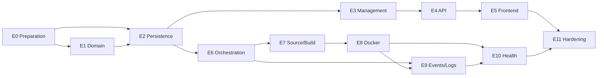

# Deployment Engine Engineering Backlog

## Operating Rules

- Status markers: `[ ]` not started, `[-]` in progress, `[x]` complete, `[!]` blocked.
- Effort is the task-file estimate: S is 1–3 hours; M is 2–3 hours. Tasks larger than one PR must be split before work begins.
- The critical path is `001 → 002 → 003 → 004 → 005 → 006 → 007 → 008 → 009 → 010 → 011 → 015 → 017 → 025 → 026 → 027 → 030 → 031 → 034 → 035 → 041 → 042 → 043 → 044 → 045`.

## Epic 0 — Preparation (Plan Phase 0, Milestone M0)

- [ ] TASK-001 Legacy Deployment Characterization — S — deps: none
- [ ] TASK-002 Isolated Test Fixtures — S — deps: 001
- [ ] TASK-003 CI and Feature Gate — S — deps: 002

## Epic 1 — Deployment Domain (Plan Phase 1, Milestone M1)

- [ ] TASK-004 Deployment Types and Specification — S — deps: 003
- [ ] TASK-005 Deployment Aggregate and Events — S — deps: 004
- [ ] TASK-006 Deployment State Machine — M — deps: 005

## Epic 2 — Persistence and Reliable Dispatch (Plan Phase 2, Milestone M1)

- [ ] TASK-007 Migration Baseline — M — deps: 002
- [ ] TASK-008 Deployment Persistence — M — deps: 006, 007
- [ ] TASK-009 Atomic Transitions and Versioning — M — deps: 008
- [ ] TASK-010 Transactional Outbox — S — deps: 009

## Epic 3 — Deployment Management Use Cases (Plan Phase 3, Milestone M2)

- [ ] TASK-011 Request Deployment Use Case — M — deps: 010
- [ ] TASK-012 Deployment Queries and DTOs — S — deps: 008, 011
- [ ] TASK-013 Stop Deployment Use Case — S — deps: 011
- [ ] TASK-014 Redeploy Use Case — S — deps: 011, 012
- [ ] TASK-015 Command Idempotency and Legacy Deprecation — M — deps: 011, 013, 014

## Epic 4 — REST API (Plan Phase 4, Milestone M2)

- [ ] TASK-016 Deployment Read API — M — deps: 012
- [ ] TASK-017 Deployment Mutation API — M — deps: 015, 016
- [ ] TASK-018 API Contract and Compatibility Tests — S — deps: 017
- [ ] TASK-019 Legacy Deploy Route Migration — S — deps: 017, 018

## Epic 5 — Frontend Integration (Plan Phase 5, Milestone M2)

- [ ] TASK-020 Frontend Deployment Client — S — deps: 018
- [ ] TASK-021 Frontend Deployment History — M — deps: 020
- [ ] TASK-022 Frontend Deployment Actions — S — deps: 020, 021
- [ ] TASK-023 Frontend Polling and E2E — S — deps: 022

## Epic 6 — Provider-Free Orchestration (Plan Phase 6, Milestone M3)

- [ ] TASK-024 Orchestrator Ports — M — deps: 010
- [ ] TASK-025 Outbox Dispatcher and Worker — M — deps: 010, 024
- [ ] TASK-026 Stage Operation Identity and Deadlines — M — deps: 025
- [ ] TASK-027 Provider-Free Orchestrator — M — deps: 024, 026
- [ ] TASK-028 Reconciler and Recovery — M — deps: 027

## Epic 7 — Source and Build (Plan Phase 7, Milestone M4 prerequisite)

- [ ] TASK-029 Source and Artifact Contracts — S — deps: 024
- [ ] TASK-030 Source Adapter and Workspace — M — deps: 027, 029
- [ ] TASK-031 Build Adapter — M — deps: 030
- [ ] TASK-032 Source/Build Cleanup Regression — S — deps: 030, 031

## Epic 8 — Docker Execution Environment (Plan Phase 8, Milestone M4)

- [ ] TASK-033 Docker Adapter Safety Policy — S — deps: 029
- [ ] TASK-034 Docker Start and Inspect Adapter — M — deps: 031, 033
- [ ] TASK-035 Docker Release and Reconciliation — M — deps: 028, 034
- [ ] TASK-036 Docker Integration Gate — S — deps: 035

## Epic 9 — Events, Logs, and Operational Reads (Plan Phase 9, Milestone M5 prerequisite)

- [ ] TASK-037 Event Publication — M — deps: 025, 035
- [ ] TASK-038 Log Ingestion and Redaction — M — deps: 031, 035
- [ ] TASK-039 Log API and Operational Read Models — M — deps: 038, 021

## Epic 10 — Health Checks (Plan Phase 10, Milestone M5)

- [ ] TASK-040 Health Policy and Adapter — M — deps: 024, 034, 039
- [ ] TASK-041 Health Orchestration — M — deps: 035, 040
- [ ] TASK-042 Execution Loss Reconciliation — S — deps: 028, 041

## Epic 11 — Production Hardening (Plan Phase 11, Milestone M6)

- [ ] TASK-043 Recovery and Migration Drills — M — deps: 042
- [ ] TASK-044 Operational Controls and Security Review — M — deps: 039, 043
- [ ] TASK-045 Launch Failure and Performance Validation — M — deps: 043, 044

## Dependency Graph

## Implementation Order and Allowed Parallel Work

1. Complete E0, then E1 and E2.
2. Complete E3 and E4 to establish public commands/reads.
3. E5 may run in parallel with E6 after E4; it is not on the execution critical path.
4. Complete E6 before E7 and E8. Do not introduce Docker before fake-provider lifecycle/recovery tests pass.
5. E9 event publication may begin after E6; execution-log work waits for E8. E10 waits for E8 and the operational visibility from E9.
6. E11 begins only when E5 and E10 are complete.

## Milestone Mapping

| Milestone | Tasks | Evidence |
| --- | --- | --- |
| M0 Safe foundation | 001–003 | CI, isolation, legacy characterization |
| M1 Deployment records | 004–010 | FSM, migrations, atomic history, outbox |
| M2 API/UI contract | 011–023 | authorized asynchronous commands and history UI |
| M3 Provider-free lifecycle | 024–028 | fake-provider, duplicate, restart, reconciliation proof |
| M4 Docker execution | 029–036 | source/build plus safe Docker execution/cleanup |
| M5 Observable serving lifecycle | 037–042 | events/logs, health-gated `Healthy`, verified-loss handling |
| M6 Launch readiness | 043–045 | drills, controls, security, measured go/no-go |

## Implementation Checklist

- [ ] No task has unlisted prerequisites.
- [ ] Every task maps to exactly one implementation-plan phase/epic.
- [ ] Every task has RFC/plan references, scope, exclusions, files, dependencies, acceptance tests, review checklist, and size.
- [ ] Domain and persistence are complete before workers or Docker.
- [ ] Docker is complete before health checks declare `Healthy` for real workloads.
- [ ] Events remain distinct from logs and neither bypasses Deployment Management.
- [ ] Launch work includes recovery, security, observability, and measurable validation.

## Backlog Review Record

The backlog was reviewed for duplicate work, hidden dependencies, oversized tasks, and implementation-plan coverage. Two intentional splits reduce risk: durable domain events (Tasks 005–010) are separate from external event publication (Task 037), and Docker start/inspect (Task 034) is separate from release/reconciliation (Task 035). The only permitted parallel path—frontend with provider-free orchestration—is explicitly recorded above. No task introduces a provider dependency into the domain or changes RFC-0001 sequencing.
